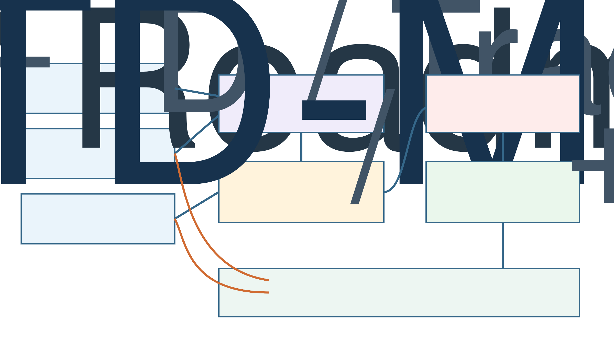
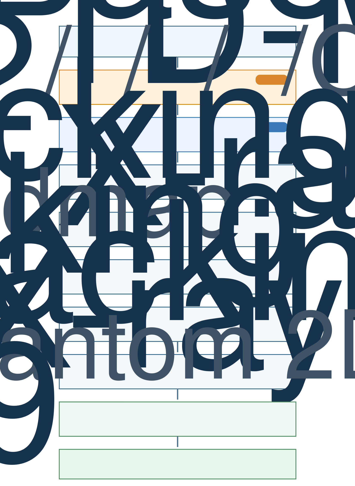

# 研究目标

本项目的目标是在**固定的患者血管结构**中，由医生指定不同目标分支或分支内目标点，系统根据实时 X-ray 透视图像、目标信息和机器人自身状态，闭环控制导丝的推进与轴向旋转，使导丝安全到达目标。

本研究不把“跨不同患者血管泛化”作为首要算法目标。针对新的患者或新的固定血管结构，可以重新建立数字模型，并在共享模型基础上进行专门训练或微调。研究重点是固定结构下的有效性、闭环性、重复性、安全性和实际部署价值。

需要区分两个概念：

- **固定血管结构**：同一套血管几何在训练和部署任务中保持不变。
- **变化目标**：每次任务可以由医生指定不同分支，以及该分支内部不同的目标点。

最终策略因此属于**目标条件化策略**，而不是只会执行一个固定目标的动作序列。

# 最终系统结构

{width=95%}

最终系统不能只输入 X-ray 图像。图像主要告诉系统“导丝当前在哪里”，但不能单独说明“医生希望进入哪个分支”。系统至少需要以下三类输入：

1. **医生提供的目标信息**：目标分支、分支内精确目标点、目标热力图或术前规划路径。
2. **实时图像信息**：X-ray 中的导丝形状、导丝尖端、血管 Roadmap 和视觉置信度。
3. **机器人自身状态**：导丝插入长度、轴向旋转角、近期动作，未来还应包括推送力或阻力。

TD-MPC2 根据这些信息规划推进和旋转动作。动作在发送给机器人之前，必须经过一个独立于强化学习策略的安全控制器。

# 研究总流程

{width=88%}

当前项目已经完成阶段 1，下一步应进入阶段 2。每个阶段都有明确的输入、输出和通过条件；前一阶段没有可靠通过时，不建议直接进入下一阶段。

# 当前代码状态

当前代码位于 `RL_TDMPC/`，已经建立了一个可训练、可恢复、可评估和可渲染的结构化状态 TD-MPC2 baseline。

| 项目 | 当前实现 |
|---|---|
| 血管结构 | 固定 `AorticArch(seed=30)` 主动脉弓 |
| 目标生成 | 每回合在候选目标分支中随机选择中心线目标点 |
| 候选分支 | `lcca`、`rcca`、`lsa`、`rsa`、`bct`、`co` |
| 器械 | 一根 J 形导丝 |
| 模拟 | SOFA BeamAdapter，摩擦系数 0.001 |
| 观测频率 | 7.5 Hz |
| 状态输入 | 14 维结构化向量 |
| 动作 | 归一化的推进速度和轴向旋转速度，共 2 维 |
| 成功条件 | 导丝尖端与目标距离小于 5 mm |
| 最长回合 | 200 个环境步骤 |
| 算法 | 官方 TD-MPC2 的最小单任务、结构化状态版本 |
| 工程功能 | 训练、Checkpoint、恢复训练、确定性评估、GUI Render、MP4 |

## 当前状态输入

当前 TD-MPC2 输入为：

| 状态成分 | 维数 | 含义 |
|---|---:|---|
| 5 个二维 Tracking 点 | 10 | 表示导丝在透视平面上的整体形状和尖端位置 |
| 二维目标点 | 2 | 告诉策略本回合需要到达的位置 |
| 旋转角的正弦和余弦 | 2 | 表示导丝当前轴向旋转状态 |
| 合计 | 14 | 固定长度的 TD-MPC2 输入 |

这些 Tracking 点目前由模拟器直接给出，可以理解为“没有视觉误差的理想感知”。它们还不是从 X-ray 图像中预测出来的。

## 当前动作

TD-MPC2 输出二维连续动作：

- 第一个维度控制导丝推进或后退；
- 第二个维度控制导丝绕自身长轴旋转。

策略输出范围为 `[-1, 1]`，环境将其映射到大约 `[-50, 50] mm/s` 的平移速度和 `[-3.14, 3.14] rad/s` 的旋转速度。

轴向旋转不是让导丝绕固定图像平面的法线旋转，而是在导丝近端对器械本身进行扭转。由于 J 形尖端具有方向，旋转会改变尖端朝向；继续推进后，导丝可能进入不同的血管分支。

## 当前奖励和终止条件

当前奖励由两部分组成：

1. 到达目标时获得成功奖励；
2. 剩余路径长度减少时获得小的塑形奖励。

可近似表示为：

$$
r_t = \mathbf{1}[\text{到达目标}] + 0.01(L_{t-1}-L_t)
$$

其中，$L_t$ 是当前时刻沿血管中心线到目标的剩余路径长度。距离目标小于 5 mm 时回合成功终止；超过 200 步仍未成功时回合被截断。

## 当前训练结果的正确解释

当前最新周期性 Checkpoint 为 `step_270000.pt`。现有确定性评估运行了 10 个回合：

- 总体成功率：70%；
- 平均回合长度：98.7 步；
- 平均回报：约 3.21。

训练日志中的累计成功率约为 88.8%，但它混合了训练期间不同模型版本、随机探索和历史回合，不能代替固定 Checkpoint 的正式评估。

当前评估样本量较小，而且没有记录每个回合对应的目标分支。因此，这些结果只能说明系统已经能够学习导航，不能说明所有目标分支都可靠。

# 阶段 0：固定血管、多目标任务定义

## 临床任务

医生从固定血管的术前规划图或 Roadmap 中指定目标。目标应同时包含：

- 目标分支；
- 分支内部的精确目标点；
- 必要时包含推荐路径或禁止进入区域。

“到达某个分支”可能有三种不同定义：

1. 导丝尖端刚进入分支开口；
2. 导丝进入分支内部某个固定深度；
3. 导丝到达医生指定的精确目标点。

当前 stEVE 任务采用第三种方式：在分支中心线上设置精确目标点。该定义比单纯的分支 ID 更明确，也更适合未来在 Roadmap 上由医生点击目标的位置选择方式。

## 目标表示

当前使用二维目标坐标。未来图像系统建议组合使用：

- 目标分支 ID；
- 投影到 X-ray 平面上的目标热力图；
- 术前血管中的三维目标坐标或规划路径。

只使用二维坐标可能产生投影重叠：不同三维血管段在 X-ray 图像中可能落在相近的二维位置。分支 ID 或三维 Roadmap 可以帮助消除这种歧义。

# 阶段 1：结构化 Tracking TD-MPC2 Baseline

这一阶段的目的是在不考虑图像识别误差的情况下，先验证导航控制问题是否可解。

每个控制周期执行以下过程：

1. 获得导丝二维 Tracking、目标位置和当前旋转角；
2. TD-MPC2 在学习到的潜在动力学模型中预测未来；
3. 规划下一步推进和旋转动作；
4. SOFA 模拟导丝与血管的力学交互；
5. 获得新状态并重新规划。

这已经是闭环控制，因为每一步动作都依赖于新的导丝状态。不过，当前感知是理想 Tracking，还没有包含真实图像的不确定性。

阶段 1 的基础代码已经完成。现阶段不应把整体训练成功率直接当成产品性能，需要先完成分支级评估。

# 阶段 2：分支级评估与失败分析

这是当前最优先的研究任务。

## 需要记录的信息

环境和评估脚本应增加：

- 当前目标分支名称；
- 当前精确目标点；
- 初始路径距离；
- 最终目标距离；
- 是否进入错误分支；
- 总推进距离；
- 总旋转量；
- 导航时间和环境步数；
- 超时、错误分支、无进展或模拟异常等失败原因。

## 评估方法

不同目标分支必须均衡采样。建议每个分支至少进行 100 个确定性评估回合，并分别报告结果。

| 目标分支 | 回合数 | 成功率 | 平均时间 | 最终目标距离 | 错误分支率 |
|---|---:|---:|---:|---:|---:|
| LCCA | 100 | 待测 | 待测 | 待测 | 待测 |
| RCCA | 100 | 待测 | 待测 | 待测 | 待测 |
| LSA | 100 | 待测 | 待测 | 待测 | 待测 |
| RSA | 100 | 待测 | 待测 | 待测 | 待测 |
| BCT | 100 | 待测 | 待测 | 待测 | 待测 |
| CO | 100 | 待测 | 待测 | 待测 | 待测 |

研究阶段可暂时把“每个目标分支成功率达到 90%”作为初步通过标准。产品阶段需要根据风险分析设置更严格的标准，不能直接沿用研究门槛。

## 阶段输出

- 一张按目标分支拆分的性能表；
- 每种失败类型的数量和视频；
- 导丝最容易失败的血管位置；
- 后续训练或环境修改的明确依据。

# 阶段 3：Tracking 噪声、延迟与控制扰动

真实图像提取的导丝位置不会像模拟器 Tracking 一样完美。该阶段仍使用结构化状态，但人工加入真实系统中可能出现的误差。

## 感知误差

按照由易到难的顺序加入：

1. 独立的坐标定位噪声；
2. 随时间连续变化的 Tracking 漂移；
3. 随机丢失一个或多个 Tracking 点；
4. 突然跳到错误位置的异常点；
5. 整帧 Tracking 丢失；
6. 一帧到数帧的观测延迟。

## 执行误差

还应加入：

- 动作执行延迟；
- 平移和旋转回差；
- 摩擦小范围变化；
- 相同命令产生稍有不同的实际位移；
- 初始插入长度和旋转角变化。

这些变化用于模拟同一固定血管和同一设备在真实操作中的不确定性，不需要随机生成新的血管几何。

## 验证策略是否真正闭环

为了避免策略只记忆动作序列，应进行以下因果测试：

- Tracking 置零后，性能是否明显下降；
- 使用另一回合的 Tracking 后，动作是否变得错误；
- 对 Tracking 加入延迟时，性能是否按延迟程度下降；
- 在回合中途扰动导丝后，策略能否恢复；
- 相同目标但不同初始旋转状态下，策略是否产生不同动作。

这些测试不是要求模型跨血管泛化，而是确认模型确实根据实时反馈执行闭环控制。

# 阶段 4：模拟 X-ray 数据与标注

当前 `TrackingOnly` 不会向策略提供真正的 X-ray 图像。需要建立一个图像和标签同步生成的数据管线。

## 每个时刻建议保存的数据

- 模拟 X-ray 或透视图像；
- 导丝中心线和关键点；
- 导丝尖端位置；
- 目标点、目标分支和目标热力图；
- 插入长度、旋转角和动作；
- C-arm 投影参数；
- 图像噪声、模糊和遮挡参数；
- 回合 ID、时间戳和成功状态。

## 图像内容

图像应逐步加入：

- 显影导丝和导丝尖端；
- 血管造影或 Roadmap 叠加；
- 骨骼和软组织背景；
- X-ray 散斑、亮度和对比度变化；
- 运动模糊；
- 局部遮挡；
- 不同曝光和 C-arm 投影角度。

临床上的普通透视通常能够看到显影导丝，但血管不一定持续可见。血管信息常来自造影帧、术前图像或 Roadmap。因此第一版产品输入更可能是“实时导丝透视图像 + 固定血管 Roadmap”，而不是一张始终清楚显示所有血管的理想图像。

# 阶段 5：图像到 Tracking，再到 TD-MPC2

这是推荐的第一个图像闭环版本。

流程为：

```text
模拟或真实 X-ray 图像序列
            ↓
导丝视觉 Tracking 网络
            ↓
5 个关键点 + 尖端位置 + 置信度
            ↓
现有目标条件化 TD-MPC2
            ↓
推进和旋转动作
```

视觉网络只负责识别导丝，现有 TD-MPC2 继续负责导航。该模块化方案容易判断失败来自感知还是控制，也方便用真实图像单独微调视觉模块。

## 必须比较的三种输入

| 输入形式 | 作用 |
|---|---|
| Oracle Tracking | 模拟器真实坐标，代表控制策略性能上限 |
| Noisy Oracle Tracking | 人工加入已知噪声，建立误差—性能关系 |
| Predicted Tracking | 视觉网络从图像预测的坐标，代表实际系统 |

主要目标是缩小 Predicted Tracking 与 Oracle Tracking 之间的闭环成功率差距。

视觉模块必须输出置信度。置信度过低时，系统应该停止、重新成像或交还医生，而不是继续执行不可靠动作。

# 阶段 6：图像、Tracking 与机器人状态混合策略

模块化图像方案成功后，再研究把视觉特征直接输入 TD-MPC2。

建议输入包括：

- 连续若干帧 X-ray 图像；
- 目标热力图；
- 目标分支 ID；
- 预测的导丝 Tracking 和置信度；
- 插入长度和旋转角；
- 最近若干步动作。

使用短图像序列比单帧更合适，因为单帧难以判断导丝正在前进还是后退、是否已经卡住，以及动作执行后是否产生了预期运动。

## 消融实验

至少比较：

- 只使用 Tracking；
- 只使用图像和目标；
- 图像加 Tracking；
- 图像、Tracking 加机器人状态；
- 去掉目标输入；
- 输入错误目标；
- 去掉图像或打乱图像顺序。

如果目标变化后动作几乎不变，说明模型没有使用目标条件；如果图像置零后性能完全不变，说明模型没有真正使用图像反馈。

# 阶段 7：真实 X-ray 与固定血管模型适配

第一步应在固定血管 Phantom 上验证，而不是直接进入患者实验。

推荐流程：

```text
术前 CTA / MRA
        ↓
血管分割与三维重建
        ↓
建立相同血管的 stEVE 数字模型
        ↓
生成患者特异模拟数据
        ↓
训练导航策略和视觉模型
        ↓
采集 Phantom 的真实 X-ray
        ↓
微调视觉模型并完成 2D–3D 配准
```

由于血管结构固定，可以针对该结构进行专门训练和微调。为了缩短每个新病例的准备时间，未来商业系统可以使用共享的预训练视觉编码器和导航模型，再进行患者特异的快速微调。

早期真实数据数量有限时，优先适配视觉感知和图像风格，不建议直接用少量真实交互重新训练整个 RL 策略。

# 阶段 8：机器人闭环、安全层与台架验证

TD-MPC2 动作不能不经检查直接发送到真实电机。策略和机器人之间必须设置一个独立、确定性的安全控制器。

## 最低安全功能

- 最大推进和后退速度；
- 最大轴向旋转速度；
- 最大插入深度；
- 推送力或阻力阈值；
- Tracking 置信度过低时停止；
- 连续无进展时停止；
- 异常弯曲、打结或进入禁止区域时停止；
- 医生能够即时接管；
- 物理急停。

安全模块不能只通过 reward 学习。它应独立于 RL，在模型输出异常时仍然能够阻止危险动作。

## 测试顺序

1. 纯软件在环；
2. 机器人控制器硬件在环，但不连接导丝；
3. 机器人连接导丝和固定透明血管模型；
4. 在真实透视设备下进行 Phantom 重复导航；
5. 主动制造低置信度、延迟、阻力和错误目标等异常场景；
6. 验证系统是否按设计停止并交还医生。

# 阶段 9：临床前验证与产品化

推荐的验证路径为：

```text
纯模拟
→ 软件在环
→ 机器人硬件在环
→ 固定血管 Phantom
→ 真实透视设备
→ 更真实的组织或临床前模型
→ 经审批的临床前研究
→ 人因、风险管理与监管验证
```

第一代产品不一定需要完成整台手术的全自主控制。更实际的功能定义是：

> 医生选择目标分支和目标点，系统自主完成一段标准化导丝导航；出现低置信度、异常阻力或复杂情况时，系统停止并交还医生。

这种自主子任务更容易验证重复性、安全性和商业价值。潜在价值包括减少重复操作负担、提高标准化程度、减少导航时间与不必要透视，并为远程机器人操作提供辅助。但这些价值必须通过正式实验验证，不能仅由模拟结果推断。

# 当前最近三项工作

## 第一项：补充分支和失败信息

在 stEVE wrapper 的 `info` 中加入目标分支、目标坐标、剩余路径距离和失败原因，并让训练和评估日志保存这些数据。

## 第二项：建立分支均衡评估

使用当前 `step_270000.pt`，对每个实际可用目标分支分别运行至少 100 个确定性回合，生成分支成功率、时间、距离和失败视频。

## 第三项：根据失败位置改进结构化 Baseline

先确认 30% 的确定性评估失败来自哪些目标、哪些分叉位置以及哪些动作模式。在所有主要目标分支达到稳定成功后，再加入 Tracking 噪声和延迟。

正确的近期顺序是：

```text
分支级评估
→ 结构化 Baseline 稳定
→ Tracking 噪声和延迟
→ 模拟 X-ray 数据
→ 图像 Tracking
→ 图像闭环导航
```

# 血管内导航基础术语

| 术语 | 简单解释 |
|---|---|
| 导丝（Guidewire） | 细长、可弯曲的器械，用来在血管中建立通路 |
| 近端（Proximal） | 靠近医生和机器人、位于患者体外的一端 |
| 远端（Distal） | 位于患者体内、靠近导丝尖端的一端 |
| J 形尖端 | 导丝末端呈弯曲形状；轴向旋转会改变尖端指向 |
| 推进/回撤 | 沿导丝长度方向向体内推入或向体外拉回 |
| 轴向旋转 | 在近端绕导丝自身长轴扭转，改变远端尖端方向 |
| 分支开口（Ostium） | 一条分支血管与主血管连接的入口 |
| X-ray 透视（Fluoroscopy） | 术中连续或脉冲式 X-ray 成像，用于观察导丝和器械 |
| C-arm | 能够围绕患者调整投影角度的 X-ray 成像设备 |
| Roadmap | 由造影或术前三维血管生成的血管路线图，与实时图像叠加 |
| Tracking | 从图像中估计导丝关键点、尖端和形状 |
| 2D–3D 配准 | 将二维 X-ray 图像与三维血管模型对齐 |
| Phantom | 用于实验的实体血管模型，不是真实患者 |
| 闭环控制 | 每次动作后重新观察系统状态，并根据新状态决定下一动作 |
| 安全控制器 | 位于 RL 策略与机器人之间，强制执行速度、力和停止规则 |

# 结论

本项目的正确定位是：**固定血管结构下，由医生指定多个可能目标的图像引导闭环导丝导航系统**。

当前结构化 TD-MPC2 baseline 已经建立，但尚未完成分支级可靠性验证。最合理的下一步不是立即加入端到端图像，而是先让当前模型对每个目标分支都具有可解释、可重复的稳定表现，再逐步加入 Tracking 误差、图像感知、真实 X-ray 适配和独立安全控制。

这个顺序能够把导航控制、视觉感知和硬件安全三个问题分开验证，并最终重新组合成一个面向实际使用的完整系统。
